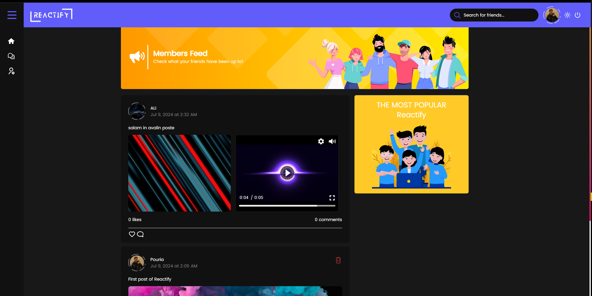
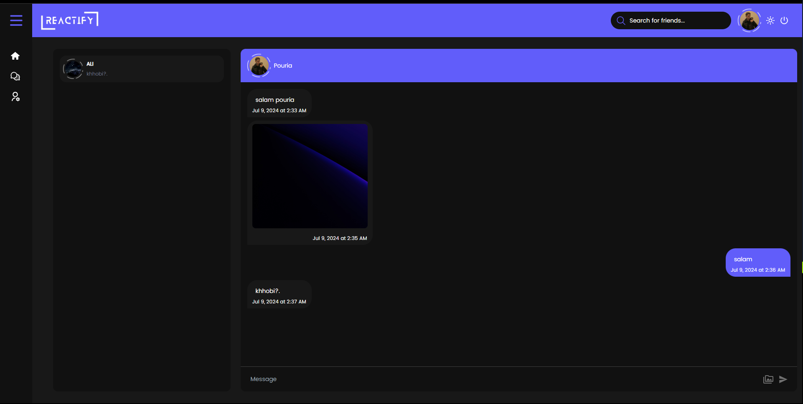
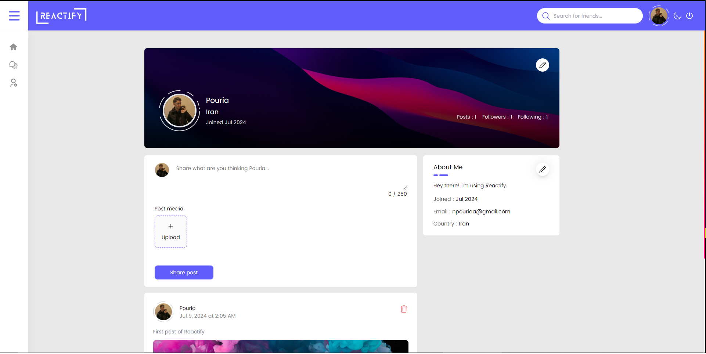
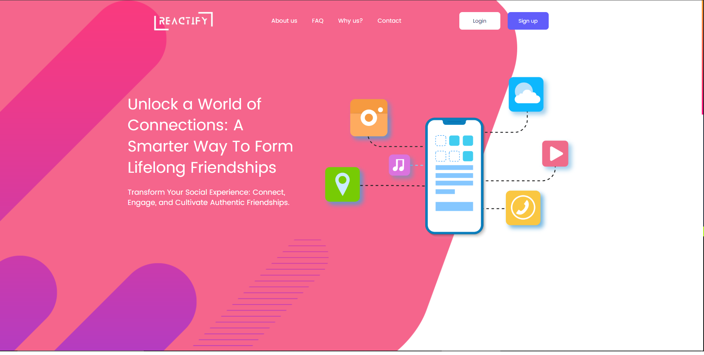

# اپلیکیشن Reactify
اپلیکیشن Reactify یک اپلیکیشن شبکه اجتماعی است که به کاربران امکان اتصال و تعامل با یکدیگر از طریق پست ها، لایک‌ ها، نظرات و پیام‌ ها را فراهم می‌کند.

ویژگی‌های کلیدی Reactify شامل:

  
پروفایل کاربر: کاربران می‌توانند پروفایل با اطلاعات شخصی و تصویر پروفایل خود ایجاد کنند.

  
صفحه پست ها: کاربران می‌توانند از طریق صفحه پست ها پست های افراد را مشاهده کنند.

  
ایجاد پست: کاربران می‌توانند پست‌های متنی یا عکسی یا ویدیویی ایجاد و با کاربران به اشتراک بگذارند.

  
لایک و نظرات: کاربران می‌توانند با لایک و نظر دادن به پست‌ها با آن‌ها تعامل کنند.

  
پیام‌ ها: کاربران می‌توانند پیام‌های خصوصی به یکدیگر ارسال کنند.

  
پروفایل کاربر: کاربران می‌توانند پروفایل با اطلاعات شخصی و تصویر پروفایل خود ایجاد کنند.

پکیج‌های استفاده شده در اپلیکیشن Reactify شامل:

  
۱. React

  
۲. Tailwind CSS

  
۳. Ant Design

  
۴. vidstack/react (برای نمایش ویدیوها)

  
۵. React Router Dom

  
۶. UUID

  
۷. Firebase (برای بخش بکند)

  
ین پکیج‌ها برای ایجاد و اجرای امکانات و ویژگی‌های مختلف اپلیکیشن مورد استفاده قرار گرفته‌اند، مانند احراز هویت کاربر، ارسال پست، لایک و نظردهی روی پست‌ها، دنبال کردن سایر کاربران و پیام‌رسانی به صورت real-time در یک محیط امن.

  
برای دیدن جزئیات بیشتر, سورس کد و بررسی رزومه از طریق <a target="_blank" href="https://t.me/npouriaa">تلگرام</a> یا <a target="_blank" href="https://www.linkedin.com/in/npouriaa">لینکدین</a> با من در ارتباط باشید.

# Reactify App
