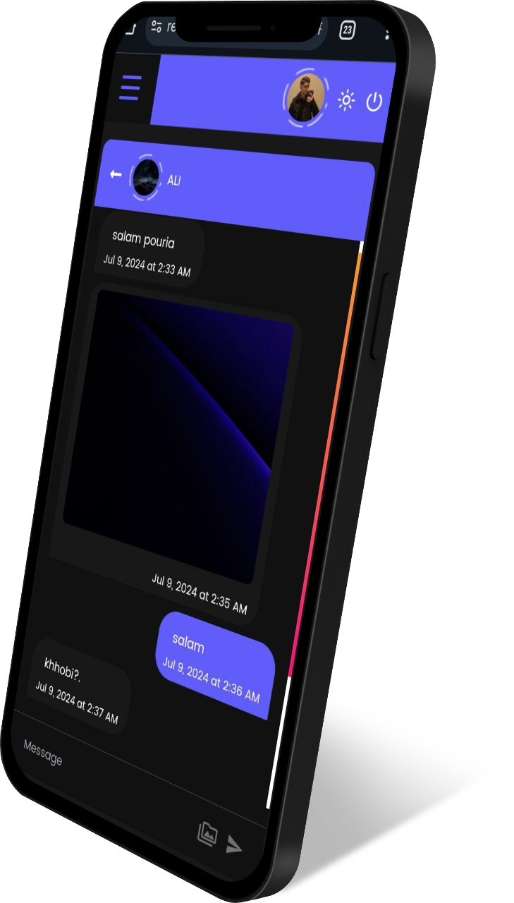

# اپلیکیشن Reactify

اپلیکیشن Reactify یک اپلیکیشن شبکه اجتماعی است که به کاربران امکان اتصال و تعامل با یکدیگر از طریق پست ها، لایک‌ ها، نظرات و پیام‌ ها را فراهم می‌کند.

ویژگی‌های کلیدی Reactify شامل:

  
پروفایل کاربر: کاربران می‌توانند پروفایل با اطلاعات شخصی و تصویر پروفایل خود ایجاد کنند.

  
صفحه پست ها: کاربران می‌توانند از طریق صفحه پست ها پست های افراد را مشاهده کنند.

  
ایجاد پست: کاربران می‌توانند پست‌های متنی یا عکسی یا ویدیویی ایجاد و با کاربران به اشتراک بگذارند.

  
لایک و نظرات: کاربران می‌توانند با لایک و نظر دادن به پست‌ها با آن‌ها تعامل کنند.

  
پیام‌ ها: کاربران می‌توانند پیام‌های خصوصی به یکدیگر ارسال کنند.

پکیج‌های استفاده شده در اپلیکیشن Reactify شامل:

  
۱. React

  
۲. Tailwind CSS

  
۳. Ant Design

  
۴. vidstack/react (برای نمایش ویدیوها)

  
۵. React Router Dom

  
۶. UUID

  
۷. Firebase (برای بخش بکند)

  
ین پکیج‌ها برای ایجاد و اجرای امکانات و ویژگی‌های مختلف اپلیکیشن مورد استفاده قرار گرفته‌اند، مانند احراز هویت کاربر، ارسال پست، لایک و نظردهی روی پست‌ها، دنبال کردن سایر کاربران و پیام‌رسانی به صورت real-time در یک محیط امن.

  
برای دیدن جزئیات بیشتر, سورس کد و بررسی رزومه از طریق <a target="_blank" href="https://t.me/npouriaa">تلگرام</a> یا <a target="_blank" href="https://www.linkedin.com/in/npouriaa">لینکدین</a> با من در ارتباط باشید تا در ریپازیتوری اصلی collaborate شوید. 

اگر از ایران قصد به استفاده از وبسایت دارید حتما با فیلترشکن وارد وبسایت شوید.

    
    
    
    
    

# Reactify App

Reactify app is a social networking application that allows users to connect and interact with each other through posts, likes, comments, and messages.

  
User Profile: Users can create a profile with personal information and profile picture.

  
Posts Page: Users can view posts from other users on the posts page.

  
Create Post: Users can create text, image, or video posts and share them with other users.

  
Likes and Comments: Users can interact with posts by liking and commenting on them.

  
Messages: Users can send private messages to each other.

The used packages in the Reactify app are:

  
1. React

  
2. Tailwind CSS

  
3. Ant Design

  
4. vidstack/react (for displaying videos)

  
5. React Router Dom

  
6. UUID

  
7. Firebase (for backend)

  
These packages are used to implement various features of the application, such as user authentication, post uploading, liking and commenting on posts, following other users, and real-time messaging in a secure environment.

  
For more details, source code, and resume review, please contact me via <a target="_blank" href="https://t.me/npouriaa">Telegram</a> or <a target="_blank" href="https://www.linkedin.com/in/npouriaa">Linkedin</a> for adding to the main repository as a collaborator.

If you want to use this website from Iran, don't forget to turn on your VPN.

